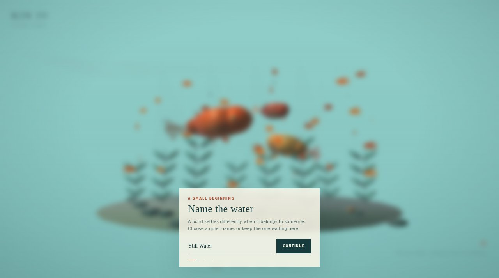

# KIN

A living goldfish pond for the browser.



**Live:** https://aeiouvcode.github.io/kin-living-pond/

## About

Name your pond, then look after it. Goldfish swim with articulated bodies and fins under travelling caustic light with a soft chromatic fringe. Tap to feed, double-tap to startle, and switch between follow and orbit cameras.

The look is inspired by RYUKIN by Masataka Hakozaki; this is an original procedural build and shares no code or assets with it.

## Built with

WebGL shaders and plain JavaScript in one `index.html`. No libraries. The pond is saved locally.

## Run locally

```sh
git clone https://github.com/aeiouvcode/kin-living-pond.git
cd kin-living-pond
python3 -m http.server 8000
```

Then open http://localhost:8000.
