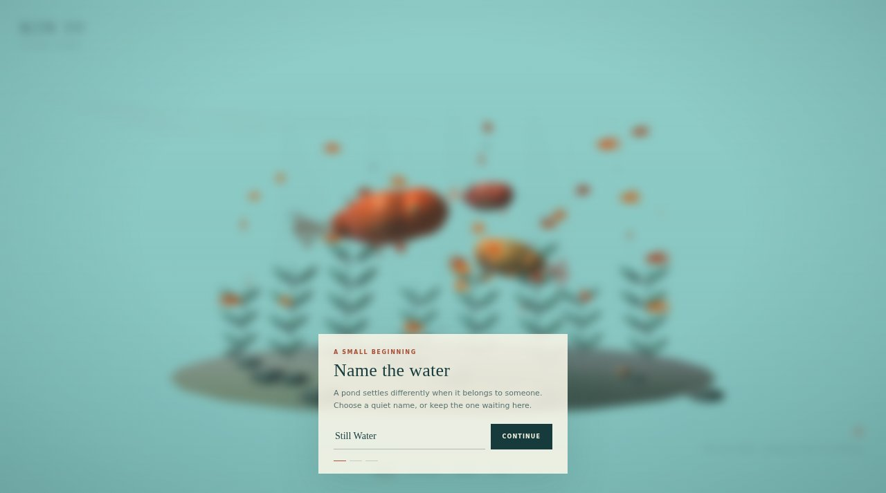

# KIN

A living goldfish pond for the browser.



**Live:** https://aeiouvcode.github.io/kin-living-pond/

## About

Name your pond, then look after it. Goldfish swim with articulated bodies and fins under travelling caustic light with a soft chromatic fringe. Tap to feed, double-tap to startle, and switch between follow and orbit cameras.

The look is inspired by RYUKIN by Masataka Hakozaki; this is an original procedural build and shares no code or assets with it.

## Built with

WebGL shaders and plain JavaScript in one `index.html`. No libraries. The pond is saved locally.

## Run locally

```sh
git clone https://github.com/aeiouvcode/kin-living-pond.git
cd kin-living-pond
python3 -m http.server 8000
```

Then open http://localhost:8000.

## Control the Godot preview locally

`node control-kin.mjs doctor` checks Godot and the project files. `snapshot` returns the source sizes and steering gap constants. `interact --frames=90` runs deterministic two-pellet QA (asserts two eats, nonzero finite gap samples) in a local Xvfb/llvmpipe session. `--width=1280 --height=800` checks desktop; defaults are 390x844. `screenshot --frames=46 --out=/tmp/kin-shot` writes a fixed-frame movie sequence and verifies that a frame exists; inspect the returned PNG pixels before claiming visual quality. `wait-settle --frames=90` measures the centerline proxy without food. `--dry-run` prints the Godot command without running it. All commands print one JSON result; failures print `ok:false` to stderr and exit nonzero. Set `GODOT=/path/to/binary` if needed. These are native/software-rendered tests, not real-phone GPU performance or actual fin-mesh collision proof.

Control logic lives in `control-kin.mjs`; source-of-truth gameplay remains `godot/labs/pond_lab.gd` and `godot/labs/water_lab/`. Avoid broad exception handling or empty-output passes. See `PLAN.md` for the logic-first test plan and `FEATURE-MAP.md` for feature routes.
`node control-kin.mjs ripple-queue` runs the isolated GPU-queue backpressure contract: enqueues 100 drops, asserts the retained 32 are IDs 68..99 in order, and drains four groups of eight. It fails on any changed count/order and on Godot errors; it does not measure GPU frame time.
`node control-kin.mjs food-lifetime` checks the six-slot Pond Next feeding failure path: three 39.75-second-old pellets remain at +0.2 s, expire at +0.3 s, a new tap fills one freed slot, and all uneaten pellets eventually expire. This runs the actual aging/spawn methods with live nodes, not the full interactive renderer.
Screenshot and interaction runs now use a temporary project root with a rewritten viewport config and an allowlist of symlinked project resources. The canonical `godot/project.godot` is never edited; a killed process may leave a temporary `/tmp/kin-control-*` directory to remove after checking no child is using it, but cannot leave a tracked viewport override or project lock. Use a fresh `--out` for screenshots; old frame paths fail rather than pass.
`node control-kin.mjs zero-gap` checks the Pond Next hard-gap correction at exact overlap, at the threshold, and inside it: two finite opposing moves separate a coincident pair to the 0.9 centerline gap, while normal separation follows the geometric vector. This is a deterministic method fixture, not true fin-mesh collision clearance.
`node control-kin.mjs ripple-bounds` checks six rejected off-canvas/nonfinite water impulses and three valid ordered boundary/center impulses against the real water-lab entry point. It does not prove touch handling in a browser or GPU frame cost.
`node control-kin.mjs fish-mesh` walks actual procedural fish meshes for both species. It asserts finite vertices/normals, valid triangle indices, ten authored parts and 8,032 nondegenerate authored triangles per species. Godot's built-in sphere primitives contribute 256/512 zero-area pole-cap faces; those are reported separately, not treated as authored-fin failures. This does not prove animated mesh intersection clearance.
The ripple queue test now invokes the same `_take_gpu_drops()` method as the real GPU step rather than duplicating its slice/drain code. It still does not measure device frame time or prove the visible response to a browser drag.
Ripple drop validation rejects nonfinite/out-of-range coordinates and nonfinite or nonpositive impulse strength/radius before either GPU enqueue or CPU Gaussian update. `node control-kin.mjs ripple-bounds` tests invalid inputs in both paths, queue order for valid edges, and a valid CPU grid update.
